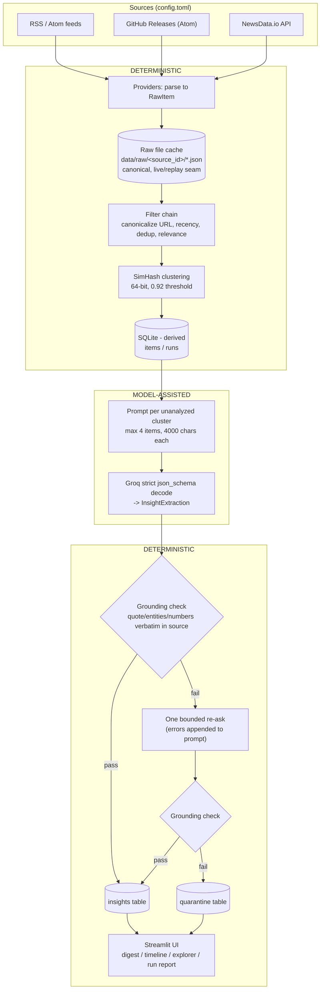

# Architecture

Competitive intelligence pipeline: fixed set of sources -> deterministic ingest and
filtering -> deterministic near-duplicate clustering -> a schema-confined LLM that
fills in structured fields for clusters that already passed -> deterministic
grounding checks -> SQLite -> Streamlit UI.

## Pipeline

## One item, end to end

A Snyk blog post published yesterday: the `rss` provider fetches the feed and
the payload lands append-only in `data/raw/snyk-blog/<url_hash>-<body_hash>.json`
(replay mode reads this same file with zero network). The filter chain
canonicalizes the URL, checks the 14-day recency window, dedups by content
hash and canonical URL, and - because `snyk-blog` is trust tier 3 - requires a
tracked alias ("snyk", "evo") in the title or snippet. `fingerprint.py`
SimHashes the normalized text: within 5 of 64 bits of an existing cluster it
joins that `cluster_id`, otherwise it starts its own. `run.py` persists the
item. `analyze.py` then builds one prompt from the cluster (max 4 items, 4000
chars each) and asks Groq for a strict `InsightExtraction`; `grounding.verify`
requires the quote, entities, and numbers to appear verbatim in the cached
source text - one failure triggers a single re-ask, a second failure sends
the raw payload to quarantine instead of the digest. `confidence` starts at
the source's trust tier and bumps one level when a second independent item
corroborates the cluster. The digest shows the insight under Snyk with its
category badge, evidence quote, and source link; the Markdown export carries
the same row.

## JFrog theme glossary

The `themes` field tags insights with the JFrog focus areas they touch
(fixed `Theme` taxonomy in `models.py`; also defined for the model in
`prompts/extract.md`):

| Theme | Meaning |
|---|---|
| `agentic_supply_chain` | AI agents operating on the software supply chain |
| `fly` | JFrog Fly, the agentic repository |
| `apptrust` | JFrog AppTrust release governance |
| `agentic_remediation` | AI-driven vulnerability fixing |
| `ai_catalog` | governed catalogs of AI models, agents, and MCP servers |
| `mlops_models` | ML model management, registries, Hugging Face |
| `github_partnership` | GitHub/Copilot integrations and ecosystem moves |

## Deterministic vs model-assisted responsibilities

Deterministic code owns every decision about **what enters the system, how items
group, and how they are ranked**. The LLM is invoked exactly once per cluster and
only to compress text it is not allowed to have selected or grouped itself.

**Deterministic (`filters.py`, `fingerprint.py`, `run.py`, `db.py`, `grounding.py`):**
- What enters: URL canonicalization, recency window (`recency_days`, default 14
  days), batch and cross-run dedup by content hash and canonical URL, and a
  relevance gate - tier 1-2 sources pass by construction, tier 3 items must match
  a tracked competitor alias (`filters.build_matcher`).
- How items group: SimHash near-duplicate clustering, 64-bit fingerprint over
  3-token shingles, items merge into the same `cluster_id` at similarity >= 0.92
  within a rolling `cluster_window_days` (default 90 days).
- How items rank: `confidence` in `grounding.py` is computed, never asserted by
  the model - it starts from the source's trust tier and is bumped one level if
  two or more independent items corroborate the same cluster.
- Fail-closed enforcement: `grounding.verify()` checks the LLM's quote, entities,
  and numbers against the cached source text with substring matching; nothing the
  model claims is trusted without this check passing.

**Model-assisted (`llm.py`, `analyze.py`, `models.InsightExtraction`):**
- Given a cluster that already passed every deterministic gate, the model fills a
  fixed schema: `summary`, `category` (one of 9 fixed values), `themes` (from a
  fixed list), `entities`, `numbers`, `quote`. `InsightExtraction` is
  `extra="forbid"` - any field or category outside the schema is a validation
  error, not a new value.
- No agentic loop and no model-decided control flow: the model never chooses
  which sources to fetch, which items to merge, or what happens next.
- On schema or grounding failure the pipeline sends exactly one re-ask with the
  specific errors appended to the prompt. If that also fails, the cluster is
  written to the `quarantine` table with the stage, error, and raw payload, and
  the run continues. Output is never coerced or silently dropped.

## Why this, not that

**Files as canonical store, SQLite as derived index - not migrations.**
Every fetched payload is written once to `data/raw/<source_id>/<url_hash>-<body_hash>.json`
and never rewritten (`cache.RawCache.put`, append-only). `data/ci.db` is rebuilt
entirely from these files and from cached LLM responses; deleting it and
re-running `run` then `analyze` reproduces the same state. This avoids a
migration story for a schema that is still moving - the DB is disposable, so
`items`/`insights`/`quarantine` can change shape without a migration path. The
raw cache is also the live/replay seam: `Fetcher.get_text` reads from the
network when `--live` is passed and from the newest matching cache file
otherwise, which is what lets the whole pipeline and UI run with zero API keys.

**SimHash, not embeddings, for near-duplicate detection.**
`fingerprint.py` builds a 64-bit SimHash from 3-token shingles of normalized
text (HTML stripped, entities and URLs removed) and compares fingerprints by
Hamming distance (`similarity() >= 0.92`, i.e. at most 5 of 64 bits differ). This
is a same-story-two-outlets check across a handful of feeds and a two-digit
number of items per run - an embedding index adds a model dependency, network
calls (or a local model to host), and vector storage for a clustering problem
that a 16-hex-character hash already solves deterministically and offline. If
source count or per-run volume grows enough that near-verbatim text stops being
the dominant duplicate pattern, embeddings become worth the added surface -
not before.

**Strict `json_schema` output, not free-text parsing.**
`llm.strict_schema()` derives a closed JSON Schema from `InsightExtraction`
(`additionalProperties: false`, every property required) and passes it to Groq
as a strict `response_format`. Free-text output would need a parser that itself
needs error handling for malformed output, and would still require the same
grounding pass afterward - strict decoding removes an entire failure class
(missing fields, wrong types, invented keys) before validation even runs, at the
cost of one documented gap: Gemini's API in `llm.py` does not support strict
schema enforcement on this path, so schema conformance for that provider is
Pydantic-only, after the fact.

**Per-source failure isolation, not a run that dies on the first bad feed.**
`run.py` fetches each configured source in its own `try/except`, records
`ok:<count>`, `no_cache`, or `error:<type>:<message>` per source, and continues.
A dead RSS feed or a NewsData quota error shows up as one line in the run report
next to sources that succeeded; it never takes down ingestion for the sources
that are fine.

**A replay seam, not "you need API keys to see this work."**
Both stages take a `--live` flag; without it, `run` replays from `data/raw/` and
`analyze` replays from cached LLM responses keyed by
`sha256(provider:model:prompt)`. The repo ships its raw cache, so the full
pipeline, LLM stage, and UI run end to end with no `GROQ_API_KEY`,
`GEMINI_API_KEY`, or `NEWSDATA_API_KEY` set.

## Components

| Module | Responsibility |
|---|---|
| `models.py` | Config schema, `RawItem`, `InsightExtraction`, the fixed `Category`/`Theme` taxonomy |
| `cache.py` | `RawCache` (append-only file store) and `Fetcher` (the live/replay seam) |
| `http.py` | Single outbound HTTP function with bounded retries honoring `Retry-After` |
| `providers/rss.py` | RSS/Atom parsing shared by feed and GitHub Releases sources |
| `providers/github_releases.py` | GitHub Releases Atom feed, reuses `rss.parse_feed` |
| `providers/newsdata.py` | NewsData.io query provider; API key travels in params, never in the cache key |
| `providers/__init__.py` | Provider registry: `source.provider` string to fetch function |
| `filters.py` | URL canonicalization, recency, dedup, and relevance gates, one counter per gate |
| `fingerprint.py` | SimHash near-duplicate fingerprinting and similarity scoring |
| `run.py` | Ingest entry point: fetch, filter, fingerprint, cluster, persist, per-source status |
| `db.py` | SQLite schema and access (`items`, `quarantine`, `insights`, `runs`) |
| `llm.py` | Groq/Gemini call functions, strict schema derivation, response caching |
| `analyze.py` | LLM stage entry point: prompt build, one bounded re-ask, quarantine routing |
| `grounding.py` | Verbatim-match verification of LLM output against source text, confidence scoring |
| `env.py` | Minimal `.env` loader |
| `__main__.py` | CLI: `run` and `analyze` subcommands, `--live`/`--summary` flags |
| `ui/app.py` | Streamlit UI, read-only against SQLite: digest, timeline, item explorer, run report |
