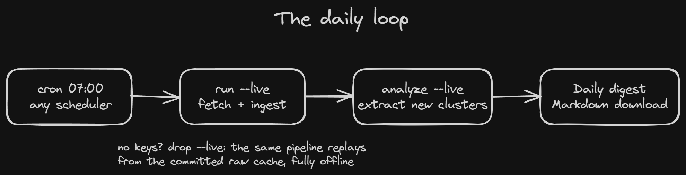
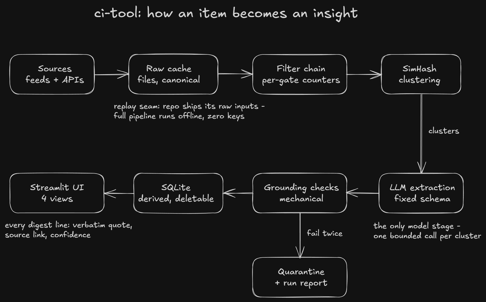

# ci-tool

A competitive intelligence pipeline for JFrog's CI team. Deterministic code decides what enters (source allowlist, recency, dedup, entity rules) and how items group; a schema-confined LLM only compresses what already passed, and every claim it makes is mechanically verified against the source text or quarantined. The result is a daily digest where every line has a verbatim quote, a source link, and a computed confidence.

## Quickstart (no API keys needed)

```bash
git clone https://github.com/RoyAbra27/ci-tool.git && cd ci-tool
uv run python -m ci_tool run && uv run python -m ci_tool analyze   # full pipeline, replayed from the bundled cache
uv run streamlit run ui/app.py                                     # web UI at http://localhost:8501
```

No install step: `uv run` syncs the environment automatically on first use.

Replay mode is the default everywhere: the repo ships its raw inputs (`data/raw/`), so the full pipeline and UI run offline with zero keys. The SQLite file is derived and safe to delete; it rebuilds from the cache.

## Live mode (optional)

Copy `.env.example` to `.env`, fill any keys you have, then add `--live`:

```bash
uv run python -m ci_tool run --live && uv run python -m ci_tool analyze --live
```

`run --live` fetches feeds and updates the raw cache; `analyze --live` calls the LLM for new clusters (GROQ_API_KEY).

"Daily" is any scheduler running those two commands, e.g. cron:

```
0 7 * * *  cd /path/to/ci-tool && uv run python -m ci_tool run --live && uv run python -m ci_tool analyze --live
```



## The web UI

Four views, reading only from SQLite:

1. **Daily digest** - the morning read: clustered insights per competitor, each with category, JFrog-theme tags, computed confidence, and the verbatim evidence quote. A metric strip separates events from marketing, and the whole digest downloads as Markdown for pasting into email or slides.
2. **Competitor timeline & comparison** - JFrog and competitors interleaved chronologically, plus a competitor-by-category count matrix (counts, deliberately no scores).
3. **Item explorer** - every ingested item with full provenance: source, trust tier, content hash, raw cache file, and the insight it produced.
4. **Run report** - per-filter drop counters for every run, plus the held-back list (the quarantine table): LLM outputs that failed schema or grounding verification, kept out of the digest by design.

## How it decides (short version)



Docs: [ARCHITECTURE.md](ARCHITECTURE.md), [ROADMAP.md](ROADMAP.md), [CHALLENGES.md](CHALLENGES.md), [EVALUATION.md](EVALUATION.md), [MODEL-GOVERNANCE.md](MODEL-GOVERNANCE.md), [SOURCES.md](SOURCES.md).

## Tests

```bash
uv run pytest -q
```
